# Авторизация в gitlab'e с помощью ssh ключей

## Проверка ssh ключей на компьюетере тестировщкика.

- Открываем консоль Git Bash (Пустк -> Все программы -> Git -> Git Bash)

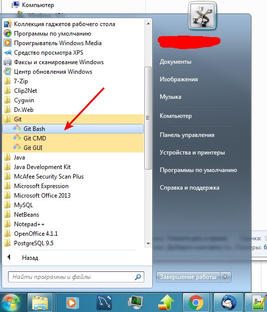

- В открывшейся консоли вводим команду 

```bash
 ls -al ~/.ssh
```

Эта команда выводит содержимое директории .ssh находящейся в домашнем каталоге пользователя. 

Если директория .ssh отсутствует:
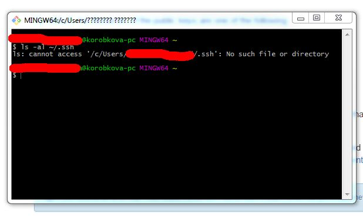

Или директория .ssh пустая
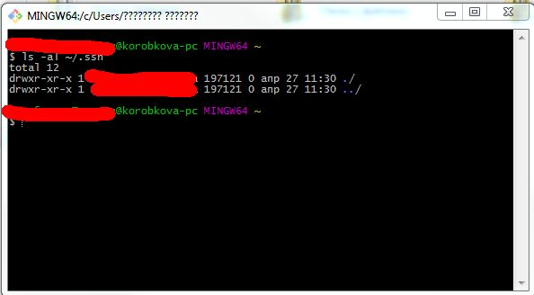


Значит в системе нет сгенерированных .ssh ключей. Тогда необходимо перейтий к пунтку [Генерация ssh ключей](#Генерация ssh ключей)

Если в директории .ssh есть сгенерированные ключи:
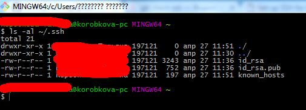

То переходим к пункту [Добавление ssh ключей в ssh-agent](#Добавление ssh ключей в ssh-agent)

## Генерация ssh ключей

- В консоль Git Bash вводим: ssh-keygen -t rsa -b 4096 -C "email@email.ru" , где email@email.ru электропочта пользователя.

На вопрос:

- Enter file in which to save the key (/c/Users/UserName/.ssh/id_rsa): - нажмаем Enter
- Enter passphrase (empty for no passphrase):  - нажмаем Enter
- Enter same passphrase again:  - нажмаем Enter

```bash
ssh-keygen -t rsa -b 4096 -C "email@email.ru"
Generating public/private rsa key pair.
Enter file in which to save the key (/c/Users/UserName/.ssh/id_rsa):
Enter passphrase (empty for no passphrase):
Enter same passphrase again:
Your identification has been saved in /c/Users/UserName/.ssh/id_rsa.
Your public key has been saved in /c/Users/UserName/.ssh/id_rsa.pub.
The key fingerprint is:
SHA256:Dpfi6jar0WjMC+kliTrxpcEBvAlEWCFLpSKWE9in4Mc email@email.ru
The key's randomart image is:
+---[RSA 4096]----+
|BB+o             |
|B+= .            |
|*B+o             |
|+++E     .       |
| ...  o S        |
|o++o.. =         |
|+=*=. . .        |
|+o=oo.           |
|.oo++o           |
+----[SHA256]-----+
```

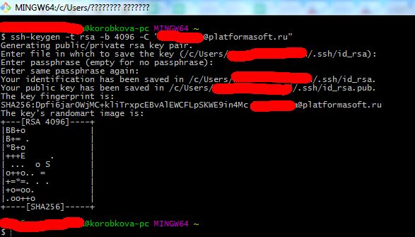

## Добавление ssh ключей в ssh-agent

- Запускаем ssh агент, для этого в консоли вводим команду:

```bash
eval "$(ssh-agent -s)"
```
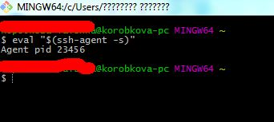

- Добавляем в ssh агент ключ, для этого в консоли вводим команду:

```bash
ssh-add ~/.ssh/id_rsa
```

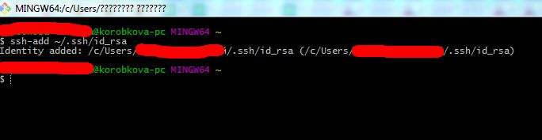

## Добавление ключей в GitLab

- Переходим на сайт GitLab'a компании, и авторизуемся

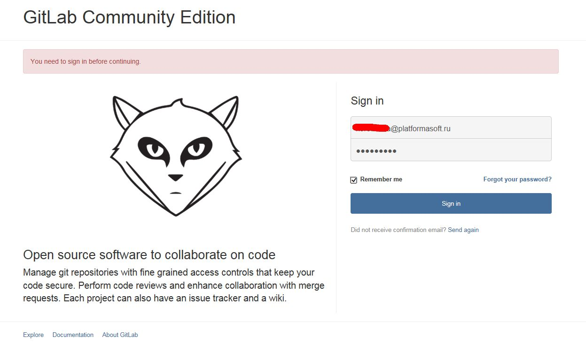

- Переходим в настройки профиля


- В настройках профиля выбираем вкадку "SSH Keys"

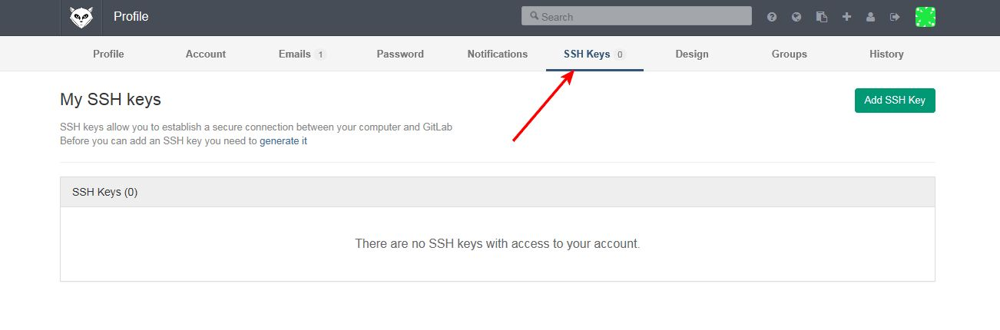

- Щелкаем по кнопке "Add SSH Key"

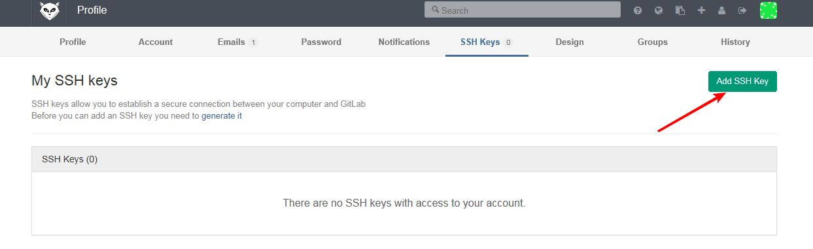

- Копируем в буфер обмена текст ключа. Для этого в консоли Git Bash выполняем следующую команду:

```bash
clip < ~/.ssh/id_rsa.pub
```

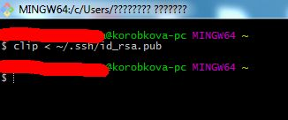

- В GitLab'e в поле добавления ключей вставляем из буфера обмена (cntrl+v), текст SSH ключа, нажимаем кнопку "Add Key"

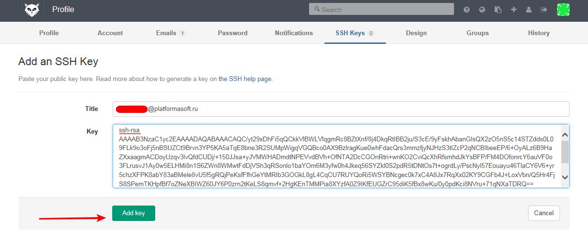


## Проверка корректности добавления ssh ключей

В Git Bash консоли вводим команду:

```bash
 ssh -T git@imc-git.mte-telecom.ru
```

При правильном выполнении всех предыдущих действий ожидается следующий результат:

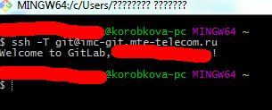


