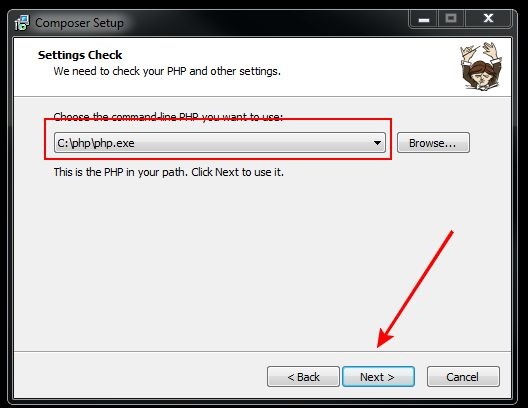
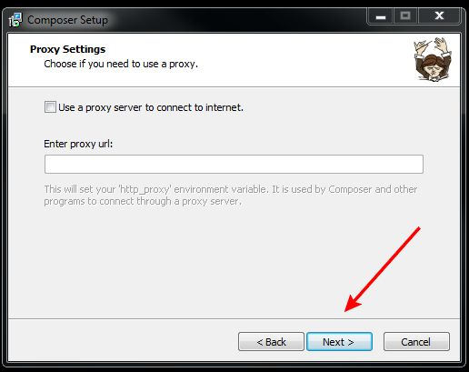
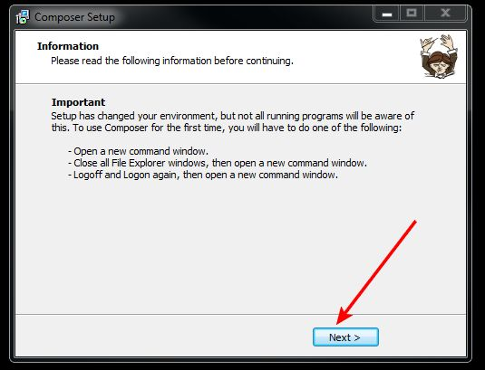
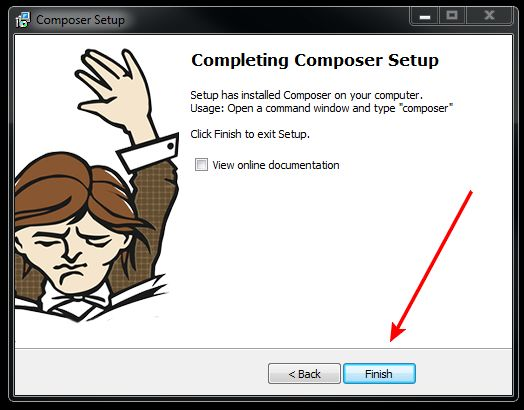

# Установка composer

- Скачать composer по ссылке [https://getcomposer.org/Composer-Setup.exe](https://getcomposer.org/Composer-Setup.exe)

- Начало установки


- Проверить что путь к php указан корректно



- На вкладке выбора proxy, ничего указывать не нужно



- Проверяем что установщик composer'a корректно определил путь до php, нажимаем "install"


- В появившемя диалоговом окне, нажимаем "Next"



- Финальное окно, появляющиеся по завершению установки



- Для проверки корркетности установки composer, заходим в git bash, и вводим команду:

```bash
composer about
```
В случае правильной установки, должен появиться следующий текст:


