# Установка git под windows

- скачиваем по  ссылке [https://git-scm.com/download/win](https://git-scm.com/download/win) - установщик git'a

## Пошаговая инструкция по установке

- Шаг - 1

- Шаг - 2

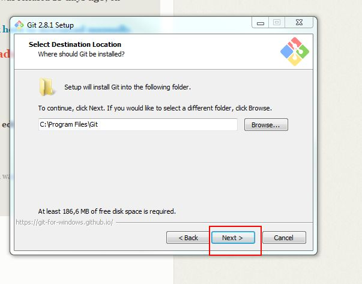

- Шаг - 3 - Установить чекбокс в "Use a TrueType font in all console windows"

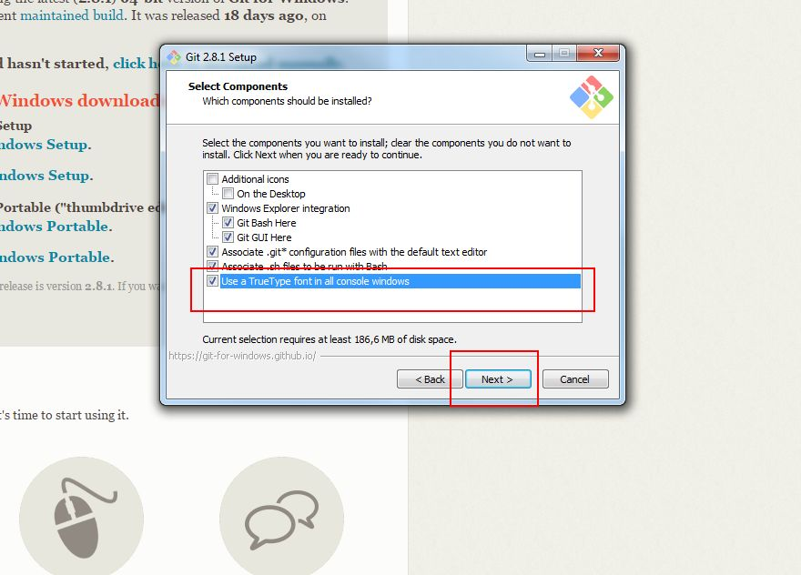

- Шаг - 4 

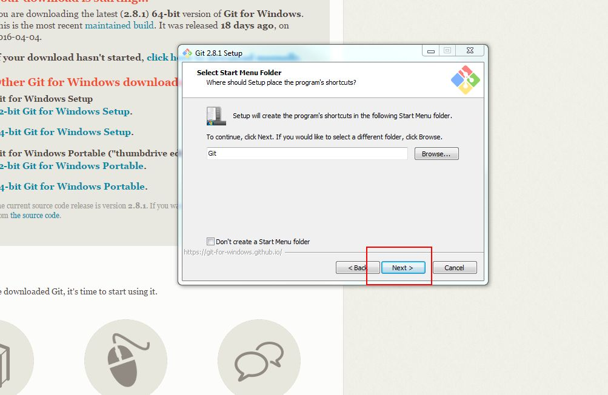

- Шаг - 5  - Выбрать "Use Git from the Windows Command Prompt"

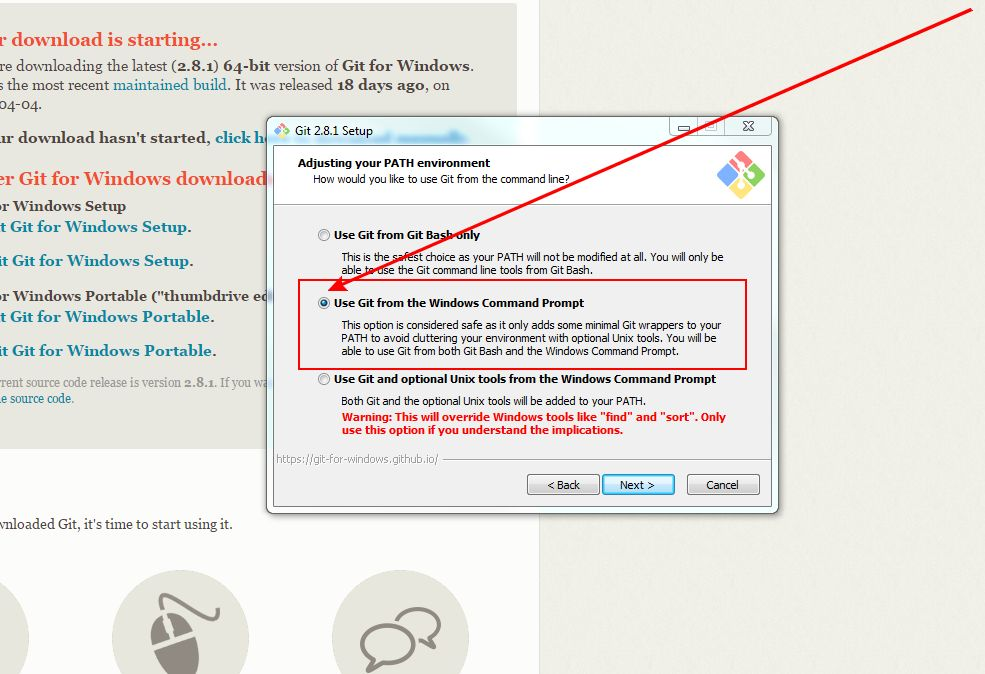

- Шаг - 6 - Выбрать "Use OpenSSH"

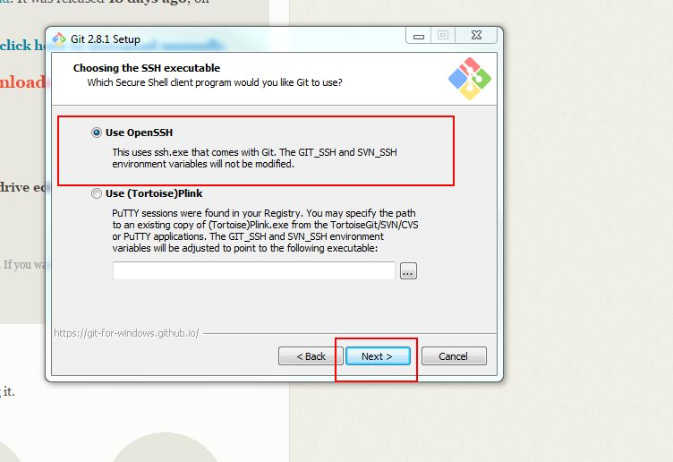

- Шаг - 7 - Выбрать "Checkout Windows-style, commit Unix-style line endings"

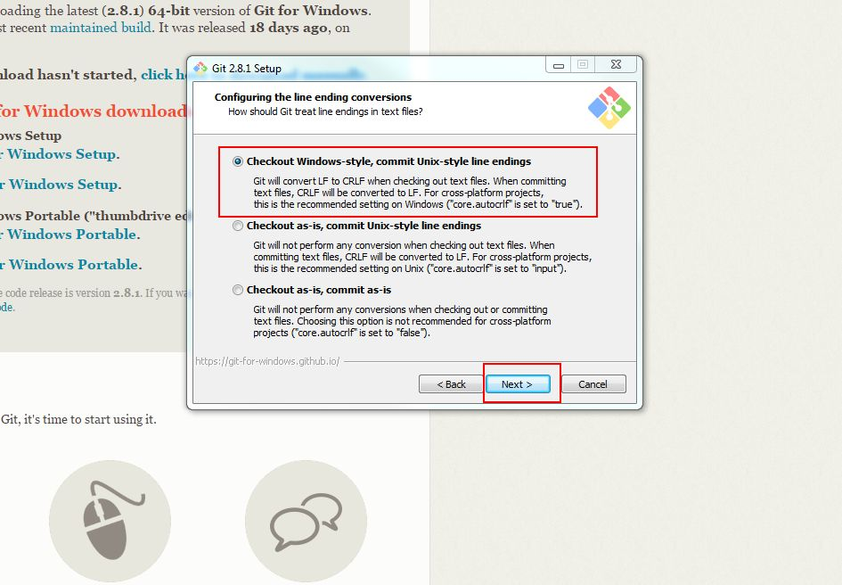

- Шаг - 8 - Выбрать "Use MinTTY (the default terminal of MSYS2)"

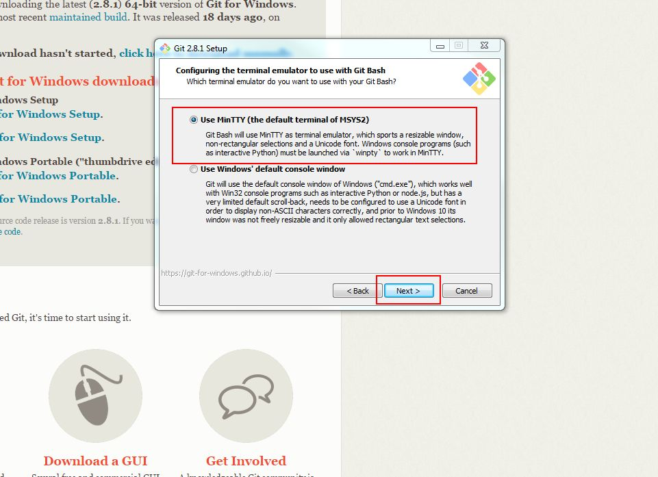

- Шаг - 9 - Убрать чекбокс  "Enable file system caching"

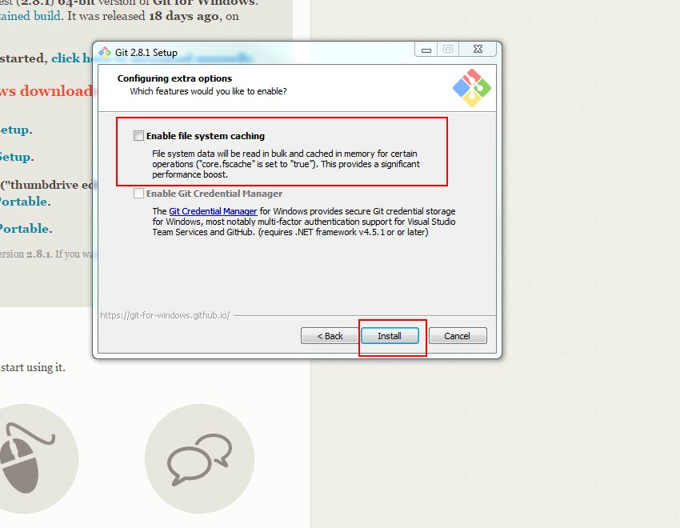

- Шаг - 10 - Установка закончена

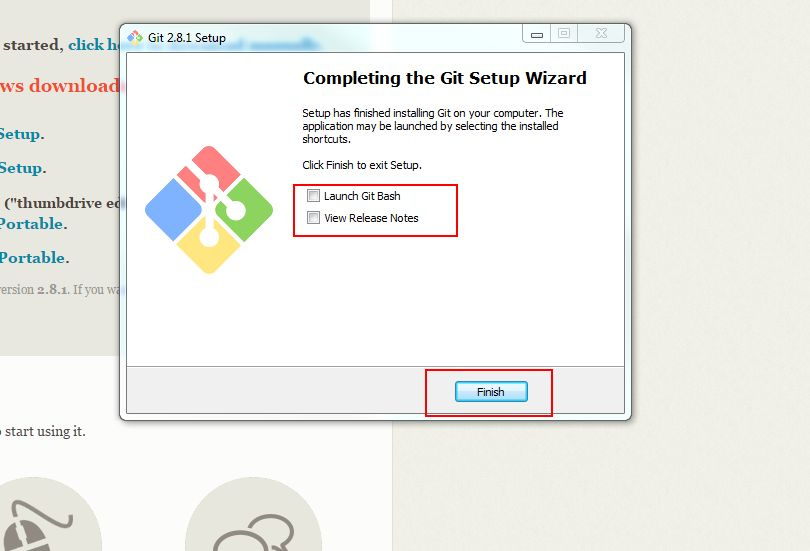

# Проверка установки

- открыть меню "Пуск" - все программы - выбрать Git- GitBush
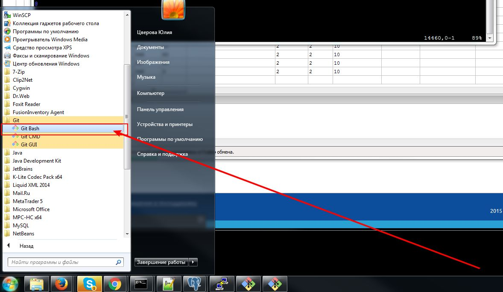

- в открывшемся окне ввести git -v и git -version 
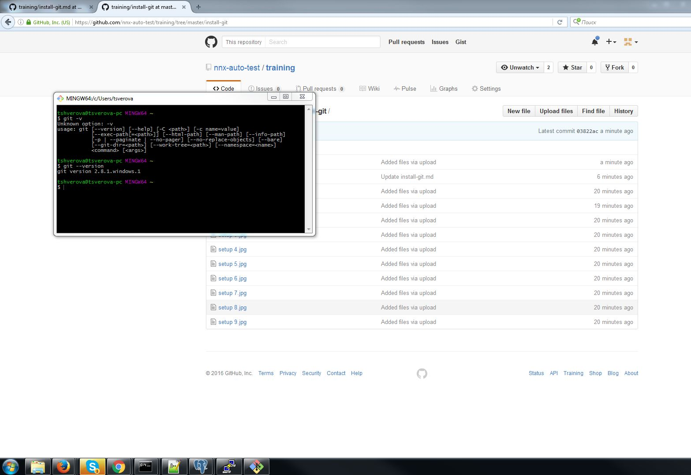
