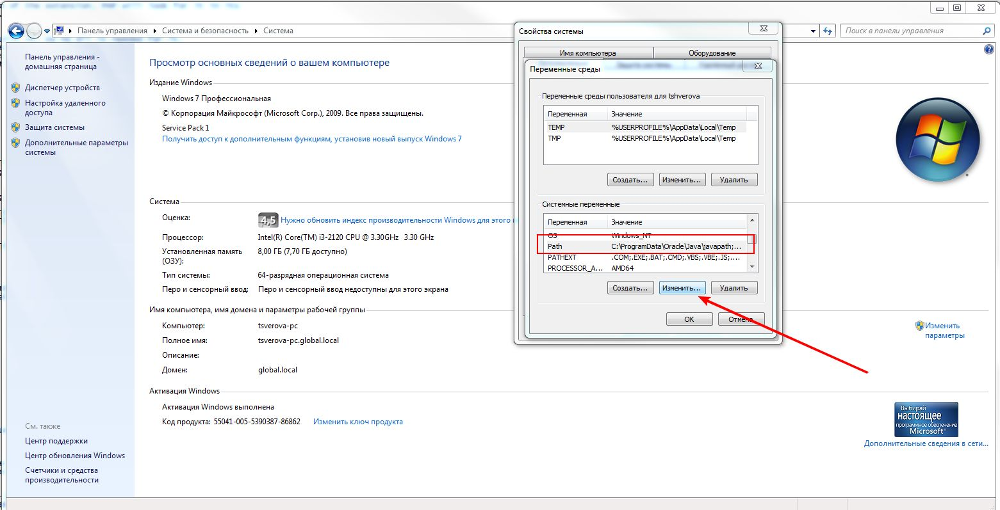

# Установка php под windows

- Переходим по ссылке [http://windows.php.net/download/](http://windows.php.net/download/)
- Необходимо скачать версию php 5.6 (выбрать Non Thread Safe)

- Создаем дирикторию c:\php (должна быть пустой)
- Распаковываем содержимое скаченного архива, директорию c:\php

- Переименовываем файл c:\php\php.ini-development в php.ini

                                   Было | Стало  
----------------------------------------|---------------------
 | 

- Открываем на редактирование файл php.ini. Далее необходимо заменить ряд  строк:

Было                        |Стало
----------------------------|------------------------------
;date.timezone =            | date.timezone = Europe/Moscow
;extension=php_curl.dll     | extension=ext/php_curl.dll
;extension=php_intl.dll     | extension=ext/php_intl.dll
;extension=php_mbstring.dll | extension=ext/php_mbstring.dll
;extension=php_openssl.dll  | extension=ext/php_openssl.dll
;extension=php_pdo_mysql.dll| extension=ext/php_pdo_mysql.dll
;extension=php_pdo_pgsql.dll| extension=ext/php_pdo_pgsql.dll
;extension=php_soap.dll     | extension=ext/php_soap.dll

# добавить php в переменные среды PATH

- выбрать меню пуск - мой компьютер - (щелчок правой кнопки мыши)- свойства

- дополнительные параметры системы
 

- параметры среды 
  

- выбираем переменную  path и нажимаем кнопку "изменить"
   

- в конец поля "Значение переменной" дописываем - ;C:\php\
   

# Проверка корректности установки 

- запускаем командную строку windows. нажимаем windows+R, вводим cmd и нажимаем кнопку "ОК"
   

-  в  появившемся окне вводим 
-  

# Исправление ошибки "Запуск программы невозможне, так как на компьютере отсутстует MSVCR110.dll. Попробуйте переустановить программу"

В случае если при запуске php возникает окно с сообщением вида "Запуск программы невозможне, так как на компьютере отсутстует MSVCR110.dll. Попробуйте переустановить программу" (в зависимости от версии операционной системы название файла может быть другим, например MSVCR100.dll).

   

Необходимо сделать следующие действия:

- Переходим по [ссылке](https://www.microsoft.com/ru-ru/download/details.aspx?id=30679)
- Щелкаем по кнопке "Скачать"
  

- Выбираем в зависимости от типа Windows "VSU4\vcredist_x64.exe" или "VSU4\vcredist_x86.exe"  и нажимаем кнопку "Next"
    
- Разрядность операционной системы можно посмотреть в настройках "Мой Компьютер"
    
- Устанавливаем скаченный файл

