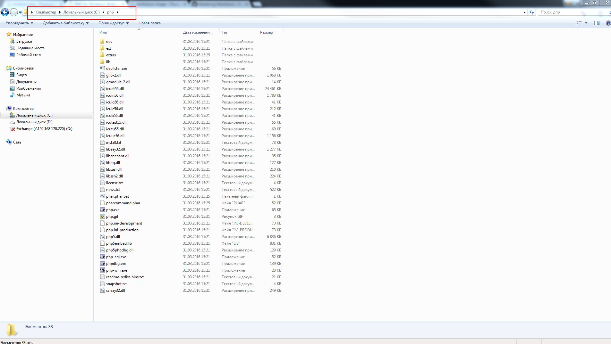
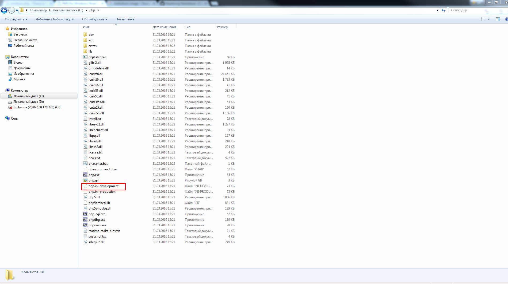

# Установка php под windows

- Переходим по ссылке [http://windows.php.net/download/](http://windows.php.net/download/)
- Необходимо скачать версию php 5.6 (выбрать Non Thread Safe)

- Создаем дирикторию c:\php (должна быть пустой)
- Распаковываем содержимое скаченного архива, директорию c:\php

- Переименовываем файл c:\php\php.ini-development в php.ini

                                   Было | Стало  
----------------------------------------|---------------------
 | 
